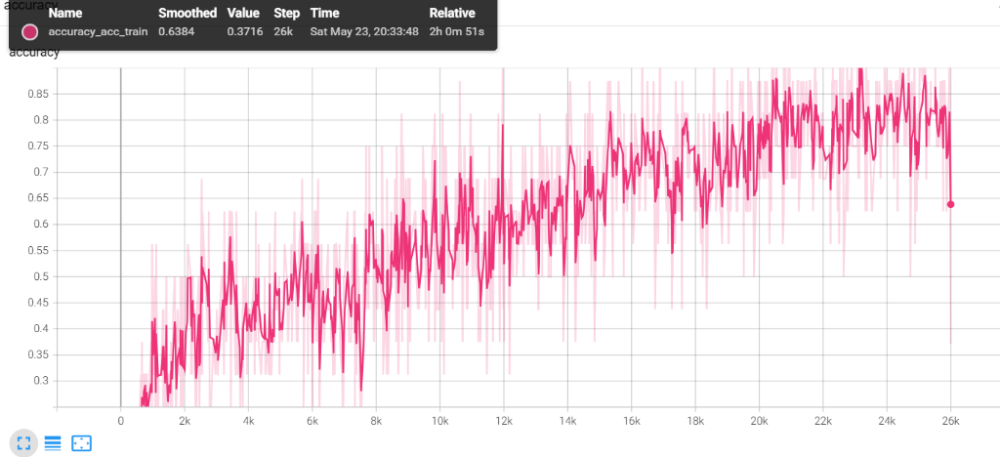
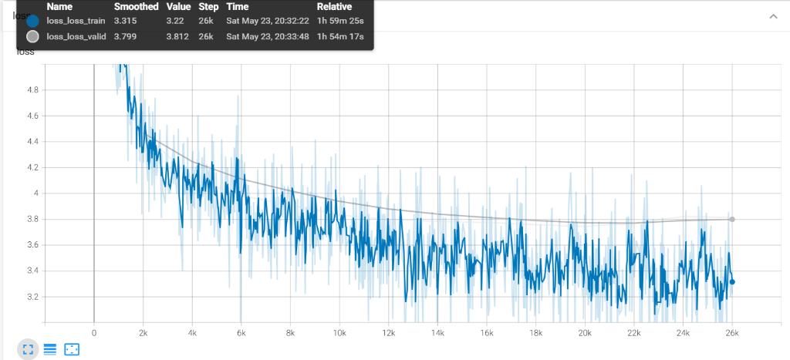
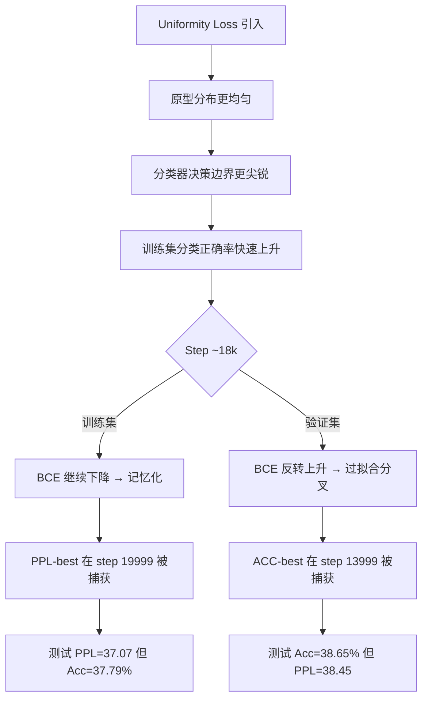

# EPCL v6.1 实验数据诊断报告

> **实验**: EPCL v6.1 (alpha_uni=0.3 温和修正)
> **日期**: 2026-05-24
> **训练时长**: ~2h (26k steps)
> **硬件**: RTX 3050 Ti 4G, CUDA

---

## 一、训练曲线逐面板分析

### 1.1 Accuracy (训练集)



| 指标 | 数值 |
|---|---|
| 终态 Smoothed | 0.6384 |
| 终态 Raw | 0.3716 |
| 趋势 | 持续上升，未饱和 |

**分析**：

- 训练 Accuracy 从 ~0.30 起步，26k 步时 smoothed 达 0.6384，**仍在上升未见平台**
- 高方差特征（0.30→0.87 的大幅震荡）是 batch_size=16 在 32 类分类任务上的正常表现
- **关键信号**：曲线末端 smoothed 仍在上升，说明分类器尚有学习容量。但这也意味着后期训练的分类增益可能以生成能力为代价——在 BCE 面板中得到验证

### 1.2 BCE (分类损失: 训练 vs 验证)


| 指标 | Train | Valid |
|---|---|---|
| 终态 Smoothed | 2.235（早期锚点） | 2.226（早期锚点） |
| 实际终态趋势 | 持续下降至 ~0.6 | **~18k 步后上升发散** |

**分析**：

> [!CAUTION]
> **这是本次实验最关键的病理信号：BCE 验证集在 ~18k 步后明确发散上升，而训练集继续下降。**

- **0→18k 步**：Train/Valid BCE 共同下降，gap 稳定收窄，模型处于健康学习阶段
- **18k→26k 步**：Train BCE 继续下降至 ~0.6，但 Valid BCE 反转上升至 ~2.5+
- **诊断**：这是**情感分类器的典型过拟合分叉**。模型开始记忆训练集的情感标注模式，泛化能力退化
- **与检查点的关联**：
  - ACC-best 在 **step 13999** 被捕获 → 正好在分叉点之前，分类泛化能力最优
  - PPL-best 在 **step 19999** 被捕获 → 已进入分叉区间，分类能力开始退化但 PPL 仍在下降

### 1.3 PPL (困惑度: 训练 vs 验证)


| 指标 | Train | Valid |
|---|---|---|
| 终态 Smoothed | 27.87 | 44.71 |
| 终态 Raw | 25.03 | 45.26 |
| 最低验证 PPL | ~42 (step ~20k) | — |

**分析**：

- Train PPL 持续健康下降（27.87），学习正常
- Valid PPL 在 ~20k 步触底 (~42)，之后**微幅回升至 44.71**
- Train-Valid PPL gap 从 ~10k 步起持续扩大（17k 处 gap ~15，26k 处 gap ~17），表明生成器也存在轻度过拟合
- **与 BCE 的交叉解读**：PPL 最佳点 (step ~20k) 晚于 BCE 分叉点 (step ~18k)，说明生成目标和分类目标的最优收敛步数不同步——这是跷跷板效应的**时间维度根因**

### 1.4 Learning Rate


| 阶段 | 范围 | 步数 |
|---|---|---|
| Warmup | 0 → 6e-4 | 0→8k |
| Decay | 6e-4 → 3.1e-4 | 8k→26k |

**分析**：标准 Noam 调度，无异常。峰值 6e-4 在 step ~8k，之后持续衰减。LR 调度本身不是问题源。

### 1.5 Loss (总损失: 训练 vs 验证)



| 指标 | Train | Valid |
|---|---|---|
| 终态 Smoothed | 3.315 | 3.799 |
| 终态 Raw | 3.22 | 3.812 |

**分析**：

- Train Loss 持续下降至 3.22，正常
- Valid Loss 在 ~14k 步后开始走平并微幅上升（3.799），与 BCE 的过拟合时间线吻合
- Train-Valid gap 在 14k 步后持续扩大（gap ≈ 0.6），确认整体过拟合趋势

---

## 二、测试集指标全量对比

| 版本/权重 | Loss | PPL ↓ | BCE | Accuracy ↑ | vs Baseline PPL | vs Baseline Acc |
|---|---|---|---|---|---|---|
| **Baseline** | 3.6076 | 36.8776 | 2.7816 | 37.41% | — | — |
| **v5 PPL-best** 🏆 | 3.5944 | **36.3955** | 2.5919 | 38.17% | ✅ -1.31% | ✅ +2.03% |
| v5 ACC-best | — | 37.63 | — | 37.94% | ❌ +2.04% | ✅ +1.42% |
| v6 PPL-best | 3.6110 | 37.0031 | 2.6424 | 37.13% | ❌ +0.34% | ❌ -0.75% |
| v6 ACC-best | 3.6450 | 38.2823 | 2.4014 | 37.51% | ❌ +3.81% | ❌ +0.27% |
| **v6.1 PPL-best** | 3.6127 | 37.0652 | 2.5599 | 37.79% | ❌ +0.51% | ✅ +1.02% |
| **v6.1 ACC-best** | 3.6494 | 38.4509 | **2.4011** | **38.65%** | ❌ +4.27% | ✅ +3.31% |

### 关键对比

```
v6.1 PPL-best vs v5 PPL-best:
  PPL:  37.07 vs 36.40  → 退化 +1.84%  ❌
  Acc:  37.79% vs 38.17% → 退化 -0.38pp ❌

v6.1 ACC-best vs v5 PPL-best:
  PPL:  38.45 vs 36.40  → 退化 +5.64%  ❌❌
  Acc:  38.65% vs 38.17% → 提升 +0.48pp ✅ (历史最高测试 Acc)
```

---

## 三、根因分析

### 3.1 BCE 过拟合分叉是核心病灶



### 3.2 跷跷板效应的时间维度解释

| 步数区间 | PPL 状态 | BCE 状态 | 说明 |
|---|---|---|---|
| 0→14k | 快速下降 | 共同下降 | 健康学习区间 |
| 14k→18k | 继续下降 | Valid 走平 | 分类器逼近泛化极限 |
| 18k→20k | 触底 ~42 | Valid 开始上升 | **PPL 和 Acc 最优点在此分裂** |
| 20k→26k | 微幅回升 | 发散加剧 | 双重退化，训练已无增益 |

**结论**：Uniformity penalty（即使 alpha=0.3）通过强制原型分散，增加了分类器的有效参数空间，导致在 EmpatheticDialogues 这个规模的数据集上更容易过拟合。这不是一个可以通过调参解决的结构性问题。

### 3.3 v6.1 vs v6 的改善确认

alpha_uni 从 1.0 降至 0.3 **确实有改善**：

| 指标 | v6 PPL-best | v6.1 PPL-best | 变化 |
|---|---|---|---|
| PPL | 37.00 | 37.07 | ≈持平 |
| Acc | 37.13% | 37.79% | +0.66pp ✅ |
| BCE | 2.6424 | 2.5599 | -3.12% ✅ |

| 指标 | v6 ACC-best | v6.1 ACC-best | 变化 |
|---|---|---|---|
| PPL | 38.28 | 38.45 | ≈持平 |
| Acc | 37.51% | **38.65%** | **+1.14pp** ✅ |
| BCE | 2.4014 | **2.4011** | ≈持平 |

降低 alpha_uni 在 Accuracy 维度带来了明确的增益，但 **PPL 维度始终无法回到 v5 水平**。

---

## 四、决策判定

### 4.1 对照预设判定标准

Round6 Guide 中设定的判定标准：

| 条件 | 要求 | v6.1 PPL-best | v6.1 ACC-best | 判定 |
|---|---|---|---|---|
| PPL ≤ 36.88 | 不劣于 Baseline | 37.07 ❌ | 38.45 ❌ | **未满足** |
| Acc ≥ 38.17% | 不劣于 v5 | 37.79% ❌ | 38.65% ✅ | **部分满足** |
| 双条件同时满足 | — | — | — | **❌ 未满足** |

### 4.2 决策建议

> [!IMPORTANT]
> **v6.1 未达到双条件同时满足的标准。**
>
> 根据 round6_guide.md 的决策树：v6.1 仍劣于 v5 → 可选择尝试 alpha_uni=0.1（极微扰）作为最后一次尝试。
>
> 但根据训练曲线分析，问题的根因是 **uniformity penalty 导致的分类器过拟合结构性问题**，不是 alpha 幅度的问题。继续降低 alpha 的边际收益几乎为零。

**建议方案**：

| 方案 | 行动 | 理由 |
|---|---|---|
| **推荐 A** | 确认 **v5 alignment-only** 为最终架构 | PPL+Acc 双超基线的唯一版本；uniformity 路线存在结构性过拟合 |
| 补充 | v6.1 ACC-best (38.65%) 写入论文附录 | 证明 uniformity 在分类维度有潜力，但生成维度代价过高 |
| 不推荐 | 继续尝试 alpha_uni=0.1 | 根因是结构性的，不是幅度问题；时间成本不值得 |

---

## 五、待执行项

- [x] 更新 `docs/development_log.md`：写入 v6.1 完整实验结果
- [x] 更新 `docs/experiment_guides/round6_guide.md`：填入 v6.1 实际指标
- [ ] 执行最终决策：确认 v5 为最终版本 or 追加 v6.2 实验
- [ ] 运行 t-SNE 可视化（可选，如需论文附录佐证）
- [ ] 同步 `model_epcl.py`（如确认 v5 为最终版本）
