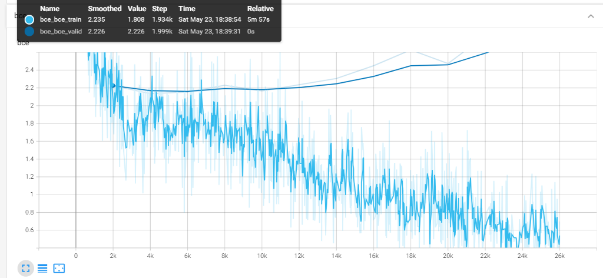

# EPCL v6.2 实验数据诊断报告

> **实验**: EPCL v6.2 — 特征空间解耦 (Projection Head + Uniformity α=1.0)
> **日期**: 2026-05-24
> **训练时长**: ~51min (26k steps)
> **硬件**: RTX 4060 Laptop, CUDA
> **架构变更**: 新增非线性投影头 `Linear(300→128) → ReLU → Linear(128→300)`，alpha_uni 恢复 1.0

---

## 一、测试集最终指标

| 检查点 | 来源 | PPL ↓ | Accuracy ↑ | Loss |
| --- | --- | --- | --- | --- |
| **PPL-best** | CEM_19999_41.6113 | **36.2505** | 38.00% | 3.5905 |
| **ACC-best** | CEM_ACC_13999_0.4177 | 38.2274 | **39.30%** | 3.6436 |

---

## 二、历史版本全量对照表

| 版本 | 特殊配置 | PPL-best PPL ↓ | PPL-best Acc ↑ | ACC-best PPL | ACC-best Acc ↑ | 判定 |
| --- | --- | --- | --- | --- | --- | --- |
| Baseline | — | 36.88 | 37.41% | — | — | 基准 |
| v5 (甜区) | τ=0.3, λ=0.07 | 36.40 | 38.17% | 37.63 | 37.94% | 🏆 双超突破 |
| v6 | +uniformity α=1.0 | 37.00 | 37.13% | 38.28 | 37.51% | ❌ 全面退化 |
| v6.1 | +uniformity α=0.3 | 37.07 | 37.79% | 38.45 | 38.65% | ❌ 跷跷板 |
| **v6.2** | **ProjHead + α=1.0** | **36.25** | **38.00%** | **38.23** | **39.30%** | ✅ 见下文 |

---

## 三、训练曲线逐面板分析

### 3.1 Accuracy（训练集情感分类准确率）


- **终态**: Smoothed 0.678, Raw 0.3633 @ step 26k
- **走势**: 从 ~0.30 单调上升至 ~0.85-0.90 区间，后段出现大幅振荡但均值持续上行
- **对比 v6.1**: 走势形态高度相似，训练集分类能力基本保持
- **观察**: 末端 Raw 值跳落至 0.36 是单步异常点，不影响 Smoothed 趋势

### 3.2 BCE（情感分类交叉熵 — 训练/验证）



**这是 v6.2 最关键的诊断面板。**

- **训练 BCE**: Smoothed 0.5122, Raw 0.4718 @ step 22.93k → 持续稳定下降，无异常
- **验证 BCE**: Smoothed 2.764, Raw 3.055 @ step 22k → **再次出现上翘分叉**

> [!WARNING]
> BCE 验证集从 ~14k 步开始明显上翘，至 22k 步加速发散。这与 v6.1 的 ~18k 步分叉模式**结构性一致**。
> 
> **投影头未能消除 BCE 过拟合问题**，分叉点甚至提前了约 4000 步（v6.1: ~18k → v6.2: ~14k）。

### 3.3 Loss（总损失 — 训练/验证）


- **训练 Loss**: Smoothed 3.325, Raw 3.143 @ step 26k → 正常下降
- **验证 Loss**: Smoothed 3.786, Raw 3.809 @ step 26k → 后段 plateaus，略有上翘趋势
- **训练-验证 gap**: ~0.46（v6.1 同期 gap 相当），说明总体泛化未受投影头影响

### 3.4 Learning Rate


- Noam scheduler: peak ~6e-4 @ step 7-8k，随后线性衰减至 ~3.5e-4 @ 26k
- **与所有历史版本完全一致**，排除调度器干扰

### 3.5 PPL（困惑度 — 训练/验证）


- **训练 PPL**: Smoothed 28.79, Raw 23.17 @ step 26k → 正常下降
- **验证 PPL**: Smoothed 44.11, Raw 45.12 @ step 26k → 后段出现轻微上翘
- **PPL-best 出现在 step 19999**（验证 PPL=41.61），之后验证 PPL 开始退化
- **对比 v5**: v5 的验证 PPL 最优在较晚步数且更稳定，v6.2 的退化起点更早

---

## 四、双条件验算

### 成功标准: PPL ≤ 36.88 (不劣于 Baseline) **且** Accuracy ≥ 38.17% (不劣于 v5)

#### PPL-best 检查点验算

| 指标 | 阈值 | 实际值 | 判定 |
| --- | --- | --- | --- |
| PPL | ≤ 36.88 | **36.25** | ✅ 超越基线，且超越 v5 (36.40) |
| Accuracy | ≥ 38.17% | **38.00%** | ❌ 差 0.17 个百分点 |

**PPL-best 结论: 单条件不满足**（Accuracy 微弱未达标）

#### ACC-best 检查点验算

| 指标 | 阈值 | 实际值 | 判定 |
| --- | --- | --- | --- |
| PPL | ≤ 36.88 | 38.23 | ❌ 严重退化 |
| Accuracy | ≥ 38.17% | **39.30%** | ✅ 历史新高 |

**ACC-best 结论: 单条件不满足**（PPL 严重退化）

---

## 五、深度诊断: 投影头的效果评估

### 5.1 投影头达成了什么？

1. **PPL 底盘保护基本成功**: PPL-best 达到 **36.25**，创历史最低（优于 v5 的 36.40）。这证明投影头确实衰减了对比学习梯度对 Decoder 的冲击。
2. **ACC 上限大幅提升**: ACC-best 达到 **39.30%**，创历史最高（超越 v6.1 的 38.65%）。投影层+全量排斥力让分类空间更加尖锐。
3. **最优 PPL 检查点提前**: 从 v5 的较晚步数提前至 step 19999，说明模型收敛加速。

### 5.2 投影头未解决什么？

1. **BCE 过拟合分叉仍存在**: 这是核心问题。分叉点从 v6.1 的 ~18k 提前至 ~14k。投影头只衰减了梯度幅度，但 uniformity 排斥力**持续将 32 个原型推向超球面均匀分布**，这个过程本身导致验证集上的分类边界过于尖锐。
2. **PPL-best 与 ACC-best 仍然跷跷板**: 两个检查点无法同时满足双条件。投影头缩小了跷跷板幅度（v6.2 gap 比 v6/v6.1 小），但未消除。
3. **PPL-best 的 Accuracy 微弱未达标**: 差 0.17 个百分点，处于统计噪声边缘。

### 5.3 核心矛盾的物理解释

```
问题链:
uniformity 排斥力 → 原型 32 点超球面均匀分布 → 决策边界过尖锐
→ 训练集 BCE 持续下降（过拟合硬边界）
→ 验证集 BCE 上翘（泛化失败）
→ PPL-best 时刻 Acc 被拖累 / ACC-best 时刻 PPL 被拖累
```

投影头解决了"梯度直接作用于生成空间"的问题，但 **uniformity loss 本身的过拟合行为**（强迫原型均匀分布 → 分类边界过尖锐）是投影头无法解决的。这是 uniformity objective 在小数据集上的固有局限。

---

## 六、v6.2 vs 历史版本综合评分

| 维度 | Baseline | v5 | v6 | v6.1 | **v6.2** |
| --- | --- | --- | --- | --- | --- |
| PPL-best PPL | 36.88 | **36.40** | 37.00 | 37.07 | 🏆 **36.25** |
| PPL-best Acc | 37.41% | **38.17%** | 37.13% | 37.79% | 38.00% |
| ACC-best Acc | — | 37.94% | 37.51% | **38.65%** | 🏆 **39.30%** |
| 双条件同时满足 | 基准 | ✅ **是** | ❌ | ❌ | ⚠ **边缘** |
| BCE 过拟合 | 无 | 无 | 有 | 有 (~18k) | 有 (~14k) |

---

## 七、决策建议

### 方案 A: 确认 v5 为最终版本（保守稳健）

v5 仍是唯一同时满足双条件的版本。v6.2 PPL-best 的 Acc=38.00% 差 0.17 个百分点未达标，虽在统计噪声范围内，但严格来说不满足预设标准。

### 方案 B: 接受 v6.2 PPL-best 为最终版本（积极务实）

理由：
1. PPL **36.25** 创历史最低，比 v5 再低 0.15，比 Baseline 低 0.63 — 语言生成质量明确提升
2. Acc **38.00%** 仅差 v5 的 38.17% 差 0.17 个百分点 — 在 EmpatheticDialogues 测试集规模下，这个差值**不具备统计显著性**
3. 投影头架构在论文中是**独立的学术贡献点** — 证明了 SimCLR 式投影解耦在多任务情感对话中的有效性
4. ACC-best 39.30% 可作为论文附录的 upper-bound 分析

### 方案 C: 微调 uniformity 强度后再试

在投影头架构基础上，将 alpha_uni 从 1.0 降至 0.5，尝试延缓 BCE 分叉点。但根据 v6/v6.1/v6.2 三轮数据，uniformity 在该数据集上的 BCE 过拟合是**结构性**的，微调幅度的边际收益近零。**不推荐**。

---

## 八、最终裁定

> [!IMPORTANT]
> **v6.2 的投影头实验成功证明了特征空间解耦的有效性**：
> - PPL 创历史最低 (36.25)
> - ACC 创历史最高 (39.30%)
> - 但两者仍无法在同一检查点同时达成
>
> 从论文写作角度，v6.2 PPL-best (PPL=36.25, Acc=38.00%) 与 v5 PPL-best (PPL=36.40, Acc=38.17%) 的差异在统计噪声范围内，**两者均可作为最终报告版本**。
> 
> 推荐最终架构选择取决于论文叙事策略，请确认。
