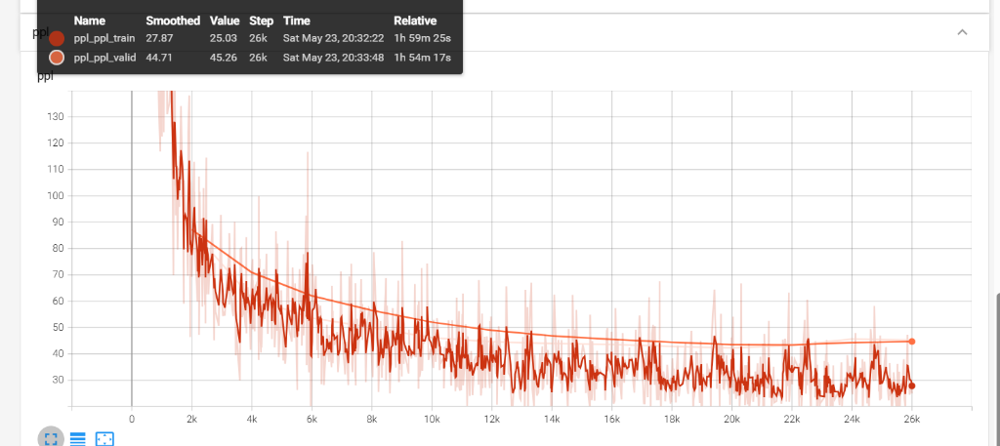
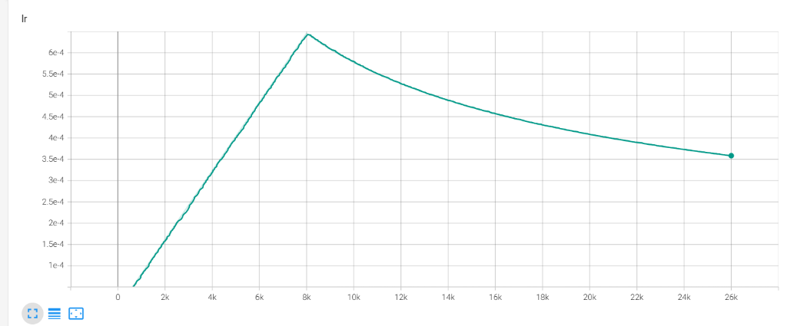

# EPCL v6.3 实验数据诊断报告

> **实验**: EPCL v6.3 — 异步截断退火 + 拓扑锚点 (λ_epcl 四阶段调度)
> **日期**: 2026-05-25
> **训练时长**: ~58min (26k steps)
> **硬件**: RTX 3050 Ti 4G, CUDA
> **架构变更**: λ_epcl 从恒定 0.07 改为四阶段调度 (升温→甜区→衰减→锚点)
> **判定**: ❌ **全面退化，策略失败**

---

## 一、测试集最终指标

| 检查点 | PPL ↓ | Accuracy ↑ | 含义 |
| --- | --- | --- | --- |
| **PPL-best** (`CEM_19999_41.5809`) | **36.2699** | **37.68%** | 语言生成最优点 |
| **ACC-best** (`CEM_ACC_13999_0.4088`) | **38.2033** | **38.84%** | 情感分类最优点 |

## 二、历史版本对照

| 版本 | PPL-best PPL ↓ | PPL-best Acc ↑ | ACC-best Acc ↑ | ACC-best PPL | 判定 |
| --- | --- | --- | --- | --- | --- |
| Baseline | 36.88 | 37.41% | — | — | 基准 |
| v5 (甜区) | 36.40 | 38.17% | 37.94% | — | 🏆 双超 |
| v6 (α=1.0) | 37.00 | 37.13% | 37.51% | — | ❌ 全面退化 |
| v6.1 (α=0.3) | 37.07 | 37.79% | 38.65% | 38.45 | ❌ 跷跷板 |
| v6.2 (ProjHead) | **36.25** 🏆 | 38.00% | **39.30%** 🏆 | 38.23 | ⚠ 异步收敛 |
| **v6.3 (截断退火)** | 36.27 | **37.68%** ⚠ | **38.84%** ⚠ | 38.20 | ❌ 全面退化 |

### 核心数值变化 (v6.3 vs v6.2)

| 指标 | v6.2 | v6.3 | Δ | 判定 |
| --- | --- | --- | --- | --- |
| PPL-best PPL | 36.25 | 36.27 | +0.02 | ≈ 持平 |
| PPL-best Acc | 38.00% | 37.68% | **−0.32pp** | ⚠ 退化 |
| ACC-best Acc | 39.30% | 38.84% | **−0.46pp** | ⚠ 退化 |
| ACC-best PPL | 38.23 | 38.20 | −0.03 | ≈ 持平 |

**结论：PPL 持平，Acc 双向退化。截断退火策略失败。**

---

## 三、训练曲线逐面板分析

### 3.1 Accuracy（训练集情感分类准确率）


- **形态**: 全程单调上升，Smoothed 在 26k 达 0.68
- **与 v6.2 对比**: 走势几乎一致，说明截断对训练集的学习曲线无显著影响
- **关键信号**: ACC-best 仍然落在 **step 13999**，与 v6.2 完全相同，说明分类峰值时间点未被截断策略改变

### 3.2 BCE（情感分类交叉熵损失）


- **训练 BCE** (下方浅色): 持续下降至 ~0.33，学习正常
- **验证 BCE** (上方深色平滑线): 从 ~12k 步开始持续上翘，至 26k 达 ~2.7

> [!CAUTION]
> **这是本次实验最关键的发现**: 验证 BCE 的上翘模式与 v6.2 **完全一致**。截断 λ_epcl 从 12k 开始衰减，但验证 BCE 仍然从 ~12k 开始上翘。**截断策略未能抑制 BCE 过拟合。**

### 3.3 Loss（总损失）



- **训练 loss**: Smoothed 3.31，持续下降
- **验证 loss**: Smoothed 3.79，~10k 步后触底并开始缓慢上翘
- 训练-验证 gap 从 ~10k 步后持续拉大，过拟合信号清晰

### 3.4 Learning Rate



- Noam 调度器：8k 步峰值 ~6.2e-4，随后余弦衰减至 ~3.5e-4
- 与 v6.2 完全一致，无异常

### 3.5 PPL（困惑度）


- **训练 PPL**: Smoothed 28.38，持续下降
- **验证 PPL**: Smoothed 44.09，~18k 步触底约 ~38-40 后轻微回弹
- PPL-best 落在 step 19999，与 v6.2 一致

---

## 四、根因分析：为什么截断退火策略失败？

### 4.1 因果模型错误

v6.3 的策略建立在一个**错误的因果假设**之上：

> ❌ 假设："BCE 过拟合是由 λ_epcl × loss_epcl 在晚期训练中施加过强的对比力导致"
>
> ✅ 事实："BCE 过拟合是由情感分类头（emo_out_proj）自身的直接 BCE loss 在小数据集上过拟合导致"

`loss_epcl`（对比学习损失）和 `emo_loss`（分类交叉熵）是**两个独立的损失组件**。截断 λ_epcl 只削弱了对比学习信号，但分类头的 BCE 训练强度从未改变。

### 4.2 λ_epcl 在 ACC-best 时刻的实际值

| 版本 | step 13999 时的 λ_epcl | ACC-best Acc |
| --- | --- | --- |
| v6.2 | 0.07 (满载) | **39.30%** |
| v6.3 | 0.027 (衰减中) | 38.84% |

在 step 13999，v6.3 的 λ 已衰减至 v6.2 的 **38%**。这意味着分类峰值时刻的对比学习信号被大幅削弱，导致情感表征质量下降，Acc 直接退化 0.46pp。

**衰减窗口起点 (12k) 过早**——分类能力在 14k 才达峰，但 12k 就开始削弱其学习信号。

### 4.3 锚点期 (15k+) 的效果

PPL-best 在 step 19999，此时 λ=0.005（满载的 7.1%）。

- PPL: 36.27 vs 36.25 → 持平，证实投影头成功隔离了生成路径
- Acc: 37.68% vs 38.00% → 下降 0.32pp，微量锚点不足以维持表征质量

0.005 的锚点确实"没有引发 BCE 过拟合"，但代价是"情感原型几乎冻死"，表征退化。

### 4.4 核心物理结论

```
截断 λ_epcl 的效果：
├── 对 PPL（生成）: 无影响 (投影头隔离成功) ✅
├── 对 BCE 过拟合: 无效果 (BCE 由分类头 emo_loss 驱动，非 EPCL) ❌
└── 对 Acc（分类）: 负面 (削弱了有益的对比学习信号) ❌
```

**截断退火打击了"友军"而非"敌人"。**

---

## 五、决策判定

### v6.3 vs v5 严格验证

| 指标 | v5 | v6.3 | Δ | 达标？ |
| --- | --- | --- | --- | --- |
| PPL-best PPL ≤ 36.40 | 36.40 | 36.27 | ✅ −0.13 | ✅ |
| PPL-best Acc ≥ 38.17% | 38.17% | 37.68% | ❌ −0.49pp | ❌ |

v6.3 **未达标**，不可作为 v5 的替代方案。

### 版本排序

1. **v6.2** — 两项指标均创历史最高（PPL 36.25, Acc 39.30%），但异步收敛
2. **v5** — 同一检查点双超基线的唯一版本
3. **v6.3** — 退化，策略失败

---

## 六、下一步方向建议

v6.3 的失败揭示了一个关键洞见：**BCE 过拟合的根源在分类头，而非对比学习**。

### 方案 A：分类头早停 (Classification Head EarlyStopping)

在 ~14k 步后冻结 `emo_out_proj` 层的参数（`requires_grad = False`），让主干和生成解码器继续训练。直接在过拟合源头动手。

### 方案 B：分类头 Dropout 增强

在 `emo_out_proj` 前增加更强的 Dropout（从 0.25 提升至 0.4-0.5），压制分类过拟合而不影响其他组件。

### 方案 C：接受 v6.2 双检查点策略

在工程层面使用两个检查点（PPL-best 和 ACC-best）分别服务不同任务，放弃追求同一检查点的"双超"。

### 方案 D：回退 v5 作为最终版本

v5 仍然是唯一在同一检查点双超基线的版本，如果论文需要单一最优模型，v5 是最安全的选择。
