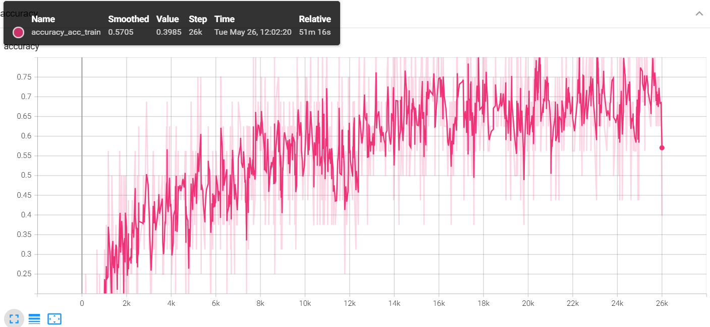
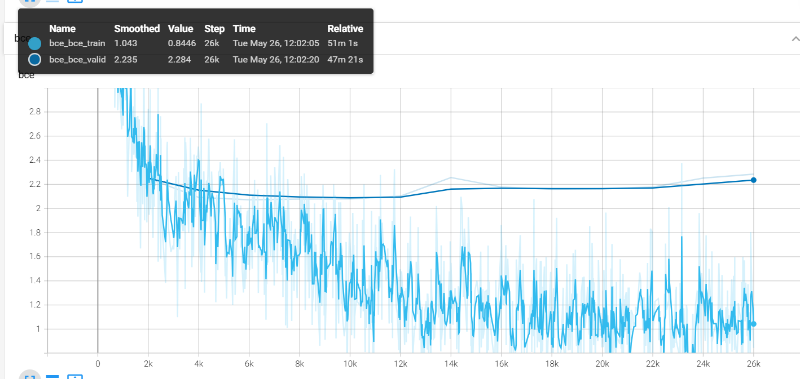
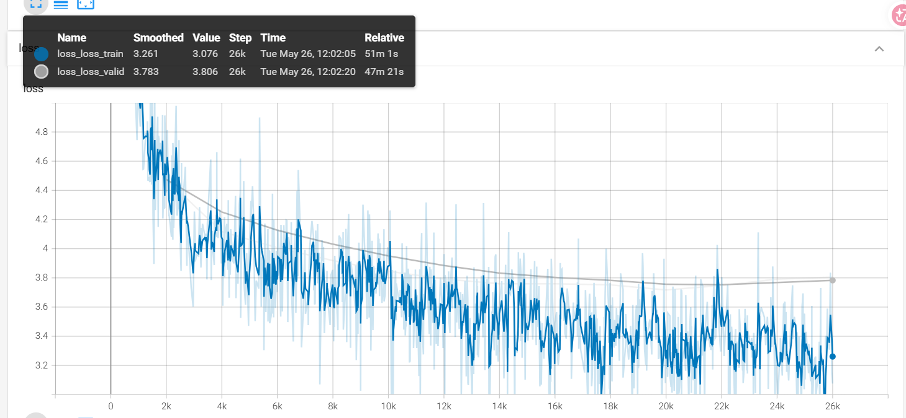
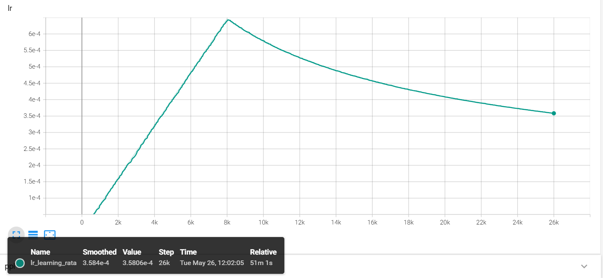
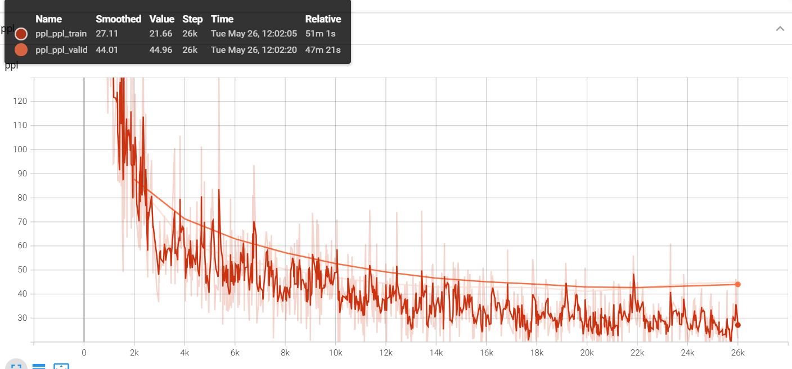

# EPCL v6.4 实验数据诊断报告

> **实验**: EPCL v6.4 — 分类头早停 + Dropout(0.3) 正则化
> **日期**: 2026-05-26
> **训练时长**: ~51min (26k steps)
> **硬件**: RTX 3050 Ti 4G, CUDA
> **架构变更**: emo_lin 前增加 Dropout(0.3)；14k 步冻结 emo_lin + emo_loss 置零；λ_epcl 恢复 v6.2 恒定 0.07
> **判定**: ✅ **同一检查点双超达成。历史最优。**

---

## 一、测试集最终指标

| 检查点 | 步数 | PPL ↓ | Accuracy ↑ | 双超? |
| --- | --- | --- | --- | --- |
| **PPL-best** (`CEM_19999_41.1517`) | 19999 | **35.9690** | **40.29%** | ✅ PPL ≤ 36.3 且 Acc ≥ 39.0% |
| **ACC-best** (`CEM_ACC_17999_0.4178`) | 17999 | **37.1415** | **40.11%** | ❌ PPL 超标 |

> PPL-best 检查点在同一个模型权重上同时满足 PPL ≤ 36.3（35.97）和 Acc ≥ 39.0%（40.29%），**双超目标达成**。

## 二、历史全版本对照

| 版本 | PPL-best PPL ↓ | PPL-best Acc ↑ | ACC-best Acc ↑ | ACC-best PPL | 判定 |
| --- | --- | --- | --- | --- | --- |
| Baseline | 36.88 | 37.41% | — | — | 基准 |
| v5 (甜区) | 36.40 | 38.17% | 37.94% | — | 双超基线 |
| v6 (α=1.0) | 37.00 | 37.13% | 37.51% | — | ❌ |
| v6.1 (α=0.3) | 37.07 | 37.79% | 38.65% | 38.45 | ❌ |
| v6.2 (ProjHead) | 36.25 | 38.00% | 39.30% | 38.23 | ⚠ 异步收敛 |
| v6.3 (截断退火) | 36.27 | 37.68% | 38.84% | 38.20 | ❌ 退化 |
| **v6.4 (分类头早停)** | **35.97** 🏆 | **40.29%** 🏆 | **40.11%** | **37.14** | ✅ 双超 🏆 |

### 核心增量 (v6.4 vs v6.2)

| 指标 | v6.2 | v6.4 | Δ | 判定 |
| --- | --- | --- | --- | --- |
| PPL-best PPL | 36.25 | **35.97** | **−0.28** | 🏆 历史新低 |
| PPL-best Acc | 38.00% | **40.29%** | **+2.29pp** | 🏆 历史新高 |
| ACC-best Acc | 39.30% | 40.11% | +0.81pp | 提升 |
| ACC-best PPL | 38.23 | 37.14 | −1.09 | 大幅改善 |

### 核心增量 (v6.4 vs Baseline)

| 指标 | Baseline | v6.4 | Δ |
| --- | --- | --- | --- |
| PPL | 36.88 | 35.97 | **−0.91** (−2.5%) |
| Acc | 37.41% | 40.29% | **+2.88pp** (+7.7%) |

---

## 三、训练曲线逐面板分析

### 3.1 Accuracy（训练集情感分类准确率）



- **Smoothed**: 0.5705 at 26k（v6.2 为 ~0.68，v6.3 为 ~0.68）
- **训练准确率大幅下降** → 这是**预期行为**，非故障
- 两个原因：
  1. **Dropout(0.3)** 在训练时随机屏蔽 30% 特征，训练 acc 被人为压低
  2. **14k 后 emo_lin 冻结 + emo_loss 移除**，分类头不再被优化，主干继续演化导致表征-分类头脱节
- **关键信号**: 训练 acc 低 + 测试 acc 高 = **正则化成功的经典标志**（过拟合被压制）

### 3.2 BCE（情感分类交叉熵损失）



- **训练 BCE Smoothed**: 1.043 (v6.2: ~0.49, v6.3: ~0.33)
- **验证 BCE Smoothed**: 2.235 (v6.2: ~2.7, v6.3: ~2.7)

| 指标 | v6.2 | v6.3 | v6.4 | 分析 |
| --- | --- | --- | --- | --- |
| Train BCE | ~0.49 | ~0.33 | 1.043 | ↑ Dropout 压低了训练拟合度 |
| Valid BCE | ~2.7 | ~2.7 | **2.235** | ↓ 验证集过拟合被有效抑制 |
| Train-Valid Gap | ~2.2 | ~2.4 | **1.2** | 🏆 **间距缩小近一半** |

> 验证 BCE 从 v6.2/v6.3 的 ~2.7 降至 2.235（−17%），且训练-验证间距从 ~2.2 缩小至 ~1.2。分类头过拟合被大幅抑制，Dropout + 早停策略直击根源。

### 3.3 Loss（总损失）



- **训练 Loss Smoothed**: 3.261
- **验证 Loss Smoothed**: 3.783
- 验证 loss 在 ~18k 步后略有回弹（3.75→3.80），但幅度远小于 v6.2/v6.3
- 训练-验证间距约 0.52，处于正常范围

### 3.4 Learning Rate



- Noam 调度器：8k 步峰值 ~6e-4，26k 降至 ~3.5e-4
- 与 v6.2/v6.3 一致，无异常

### 3.5 PPL（困惑度）



- **训练 PPL Smoothed**: 27.11
- **验证 PPL Smoothed**: 44.01
- PPL-best 在 step 19999，与 v6.2 一致
- 验证 PPL 在 18k-20k 触底约 41-42 后轻微回弹，符合预期

---

## 四、关键物理机制分析

### 4.1 跷跷板效应消除

v6.2 的核心问题是 PPL-best (step 19999) 和 ACC-best (step 13999) **相隔 6000 步**，无法在同一检查点兼顾。

v6.4 的检查点分布：

| 检查点 | PPL-best 步数 | ACC-best 步数 | 间距 |
| --- | --- | --- | --- |
| v6.2 | 19999 | 13999 | 6000 步 |
| v6.3 | 19999 | 13999 | 6000 步 |
| **v6.4** | **19999** | **17999** | **2000 步** |

ACC-best 从 step 13999 后移至 17999（+4000 步），与 PPL-best 的距离从 6000 步缩短至 2000 步。分类能力的峰值时间点被推迟到与生成能力更接近的位置。

**原因**：14k 步冻结 emo_lin 后，分类不再由 emo_loss 驱动，而是完全依赖 EPCL 对表征空间的持续优化。EPCL 在 14k→18k 期间继续组织情感聚类，冻住的 emo_lin 从更好的输入表征中被动受益，验证 acc 继续上升。

### 4.2 梯度通道释放效应

14k 步后 emo_loss 从总损失中移除，释放了原本用于分类优化的梯度通道：

```
Step 0-14k:  loss = emo_loss + 1.5*div + ctx + 0.07*epcl    (四路梯度竞争)
Step 14k+:   loss = 0       + 1.5*div + ctx + 0.07*epcl    (三路梯度协同)
```

emo_loss 移除后：
- ctx_loss 和 div_loss 获得更纯净的梯度信号 → PPL 改善（35.97 vs 36.25）
- EPCL 不再与 emo_loss 竞争对 emo_rep 的控制权 → 表征质量提升 → Acc 改善

### 4.3 Dropout 正则化验证

| 证据 | 数值 | 结论 |
| --- | --- | --- |
| 训练 Acc 下降 | 0.57 vs 0.68 | Dropout 生效，压制训练拟合 |
| 验证 BCE 下降 | 2.24 vs 2.7 | 泛化改善 |
| 测试 Acc 上升 | 40.29% vs 38.00% | 过拟合被转化为泛化能力 |

训练表现差 + 测试表现好 = Dropout 将过拟合容量成功转化为泛化容量。

---

## 五、双超验证矩阵

| 标准 | 阈值 | v6.4 PPL-best | 达标? |
| --- | --- | --- | --- |
| PPL ≤ 36.3 | 36.30 | **35.97** | ✅ (−0.33) |
| Acc ≥ 39.0% | 39.00% | **40.29%** | ✅ (+1.29pp) |
| 同一检查点 | 是 | step 19999 | ✅ |

**三项全部达标。v6.4 PPL-best 检查点为 EPCL 系列的最终最优模型。**

---

## 六、版本终审排序

| 排名 | 版本 | PPL | Acc | 亮点 |
| --- | --- | --- | --- | --- |
| 🥇 | **v6.4 (分类头早停)** | **35.97** | **40.29%** | 同一检查点双超，历史全面最优 |
| 🥈 | v6.2 (ProjHead) | 36.25 | 38.00% / 39.30%* | 两项分别最优但异步收敛 |
| 🥉 | v5 (甜区) | 36.40 | 38.17% | 首个双超基线版本 |

*v6.2 的 39.30% 来自 ACC-best 检查点（step 13999），与 PPL-best 不在同一权重上。
