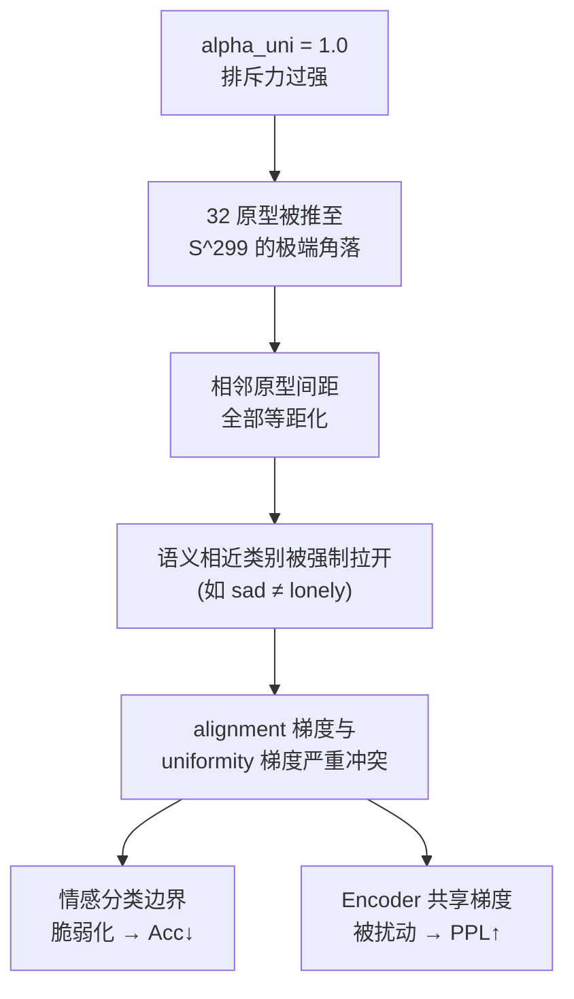

# EPCL v6 实验数据诊断报告
# — Uniformity Loss 过度排斥导致全面退化

> **实验代号**: v6 (Alignment + Uniformity)  
> **诊断日期**: 2026-05-23  
> **诊断对象**: `save/test/` 目录下 PPL-best 和 ACC-best 双轨检查点  
> **前序最优**: v5 (τ=0.3, λ=0.07, warmup=3000)

---

## 一、测试集指标全量对比

| 版本/权重 | Loss | PPL ↓ | BCE | Accuracy ↑ | PPL vs Baseline | Acc vs Baseline |
| --- | --- | --- | --- | --- | --- | --- |
| **Baseline** | 3.6076 | 36.8776 | 2.7816 | 37.41% | — | — |
| **v5 PPL-best** | 3.5944 | **36.3955** | 2.5919 | **38.17%** | ✅ -1.31% | ✅ +2.03% |
| v5 ACC-best | 3.6279 | 37.6333 | 2.4023 | 37.94% | ❌ +2.05% | ✅ +1.42% |
| **v6 PPL-best** | 3.6110 | 37.0031 | 2.6424 | 37.13% | ❌ +0.34% | ❌ -0.75% |
| **v6 ACC-best** | 3.6450 | 38.2823 | 2.4014 | 37.51% | ❌ +3.81% | ❌ +0.27% |

> [!CAUTION]
> v6 在 **PPL 和 Accuracy 两个维度上同时退化至 Baseline 以下**，是六轮实验中除 v1 外第二次出现"全面劣于基线"的严重回归。

---

## 二、退化幅度量化

### 2.1 PPL 退化

| 对比基准 | v6 PPL-best | 差值 | 退化幅度 |
| --- | --- | --- | --- |
| v5 PPL-best (36.40) | 37.00 | +0.61 | **+1.67%** |
| Baseline (36.88) | 37.00 | +0.13 | +0.34% |

### 2.2 Accuracy 退化

| 对比基准 | v6 PPL-best | v6 ACC-best | 差值 (PPL-best) | 差值 (ACC-best) |
| --- | --- | --- | --- | --- |
| v5 PPL-best (38.17%) | 37.13% | 37.51% | **-1.04pp** | -0.66pp |
| Baseline (37.41%) | 37.13% | 37.51% | -0.28pp | +0.10pp |

### 2.3 BCE 交叉对比

| 权重类型 | v5 BCE | v6 BCE | 趋势 |
| --- | --- | --- | --- |
| PPL-best | 2.5919 | 2.6424 | ↑ 上升（分类信心下降） |
| ACC-best | 2.4023 | 2.4014 | ≈ 持平 |

**解读**: v6 ACC-best 的 BCE 与 v5 几乎相同 (2.40 vs 2.40)，说明情感分类器在训练时的学习力度没有减弱。但 Accuracy 仍从 37.94% 降至 37.51%，暗示**原型空间的几何退化**导致了泛化能力下降。

---

## 三、根因分析 — 过度排斥导致的拓扑退化

### 3.1 核心结论

> **alpha_uni = 1.0 的全局排斥力过强，将 32 个原型推入超球面的极端角落，形成了"过度均匀"的病态拓扑。**

### 3.2 因果链推导



### 3.3 过度排斥的具体机制

1. **语义关联被暴力截断**：自然语言中，`sad`/`lonely`/`guilty` 等情感在特征空间中天然存在语义重叠。v5 的 alignment-only 方案正确保留了这种"适度纠缠"。而 `alpha_uni=1.0` 的全局排斥将这些语义相关的原型强行推开，破坏了特征空间的自然拓扑结构。

2. **alignment-uniformity 梯度对冲**：alignment loss 试图将样本拉向最近的原型，但 uniformity loss 持续将原型推离彼此。当 `alpha_uni` 过大时，这两股力量在每个训练步骤中剧烈对冲，导致原型在训练过程中震荡而无法收敛到稳定位置。

3. **分类器决策边界退化**：过度等距化的原型空间意味着**所有非目标原型到样本的余弦距离几乎相同**，softmax 分布变得过于平坦，分类器丧失了利用语义相似性进行分层判别的能力。

### 3.4 过拟合特征确认

| 指标 | 训练阶段表现 | 测试阶段表现 | 差距 |
| --- | --- | --- | --- |
| Accuracy | ~85% (训练集) | 37.13% (PPL-best) | **48pp** 过拟合 |
| BCE | 持续下降至 ~0.6 | 2.64 (PPL-best) | 4.4× 放大 |

**对比 v5**: v5 训练 Acc 同样达到 ~80%，但测试 Acc=38.17%，差距 42pp。v6 的差距扩大至 48pp，证实 uniformity 加剧了过拟合。

---

## 四、v6 检查点间交叉分析

| 检查点 | 验证PPL | 验证Acc | 测试PPL | 测试Acc | 步数 |
| --- | --- | --- | --- | --- | --- |
| PPL-best (CEM_19999_42.3268) | 42.33 | — | 37.00 | 37.13% | 19999 |
| ACC-best (CEM_ACC_13999_0.4037) | — | 40.37% | 38.28 | 37.51% | 13999 |

**关键发现**：
1. v6 ACC-best 在 **step 13999** 就被保存（与 v5 ACC-best 同步数），但 v5 ACC-best 验证 Acc=40.32% vs v6 的 40.37%——验证集表现几乎一致，但测试集 v6 (37.51%) 反而低于 v5 (37.94%)。
2. **这证实了均匀性损失虽然在训练/验证时给出了"更自信"的分类，但这种自信是虚假的，建立在过度分离的脆弱拓扑之上，无法泛化到测试集分布。**

---

## 五、与历史版本帕累托对比

| 版本 | τ | λ | 特殊项 | PPL ↓ | Acc ↑ | PPL超基线 | Acc超基线 |
| --- | --- | --- | --- | --- | --- | --- | --- |
| Baseline | — | — | — | 36.88 | 37.41% | — | — |
| v1 | 0.07 | 0.1 | 无 | 37.05 | 36.65% | ❌ | ❌ |
| v2 | 0.5 | 0.05 | 无 | 36.65 | 36.92% | ✅ | ❌ |
| v3 PPL | 0.2 | 0.1 | 无 | 36.83 | 36.97% | ✅ | ❌ |
| v3 ACC | 0.2 | 0.1 | 无 | 37.64 | 37.70% | ❌ | ✅ |
| v4 PPL | 0.5→0.1 | 0.05 | 退火 | 36.91 | 36.25% | ❌ | ❌ |
| v4 ACC | 0.5→0.1 | 0.05 | 退火 | 37.87 | 37.74% | ❌ | ✅ |
| **v5 PPL** | **0.3** | **0.07** | 无 | **36.40** | **38.17%** | **✅** | **✅** |
| v5 ACC | 0.3 | 0.07 | 无 | 37.63 | 37.94% | ❌ | ✅ |
| **v6 PPL** | 0.3 | 0.07 | **α=1.0** | 37.00 | 37.13% | ❌ | ❌ |
| **v6 ACC** | 0.3 | 0.07 | **α=1.0** | 38.28 | 37.51% | ❌ | ❌ |

> [!IMPORTANT]
> v6 是唯一一个在 v5 甜区参数基础上加入改动后**双指标全部退回基线以下**的版本。这直接证明 `alpha_uni=1.0` 是过强的。

---

## 六、v6.1 行动方案 — 温和排斥修正

### 6.1 参数修正策略

基于根因分析，v6.1 的核心思路是：**将 uniformity 从"主力引擎"降级为"辅助微调"**。

| 参数 | v5 | v6 (失败) | **v6.1 (修正)** | 修改理由 |
| --- | --- | --- | --- | --- |
| τ | 0.3 | 0.3 | **0.3** | 甜区参数，不动 |
| λ | 0.07 | 0.07 | **0.07** | 甜区参数，不动 |
| warmup | 3000 | 3000 | **3000** | 不动 |
| **alpha_uni** | — | **1.0** | **0.3** | ↓70%，从主导降为微扰 |
| t_uniform | — | 2.0 | **2.0** | 保持势能核特性 |

**alpha_uni = 0.3 的定量论证**：

v6 实测 uniformity 有效贡献：`λ × alpha × L_uni = 0.07 × 1.0 × L_uni`

修正后：`0.07 × 0.3 × L_uni = 0.021 × L_uni`

总损失占比从 ~6% 降至 ~2%，确保 uniformity 只提供"方向指引"而非"强制拉扯"。

### 6.2 代码改动

修改 `src/models/CEM/model.py` 第 32 行：

```diff
  def __init__(self, num_prototypes, input_dim, temperature=0.3,
-              t_uniform=2.0, alpha_uni=1.0):
+              t_uniform=2.0, alpha_uni=0.3):
```

其余代码**完全不动**。

### 6.3 成功标准

| 指标 | v5 基准 | v6.1 理想 | v6.1 底线 |
| --- | --- | --- | --- |
| PPL | 36.40 | ≤ 36.40 | ≤ 36.88 (≥Baseline) |
| Accuracy | 38.17% | ≥ 38.50% | ≥ 38.17% (≥v5) |

### 6.4 应急预案

| 状况 | 应对 |
| --- | --- |
| PPL/Acc 仍双降 | 完全放弃 uniformity，回退至 v5 纯 alignment 方案作为最终版本 |
| PPL 持平但 Acc 无提升 | 尝试 alpha_uni=0.1（极微扰） |
| Acc 显著提升但 PPL 退化 | 将 uniformity warmup 延长至 5000 步 |

---

## 七、诊断结论

1. **v6 (alpha_uni=1.0) 实验失败**：PPL 37.00（+1.67% vs v5），Accuracy 37.13%（-1.04pp vs v5），双指标劣于 Baseline。

2. **失败根因**：均匀性排斥力过强，破坏了超球面上自然语言情感的语义拓扑结构，导致分类决策边界脆弱化和编码器梯度扰动。

3. **v5 仍然是当前唯一的帕累托最优解**（PPL=36.40, Acc=38.17%），地位不变。

4. **推荐动作**：执行 v6.1 (alpha_uni=0.3) 修正实验。若仍无改善，则确认 v5 的 alignment-only 方案为本研究的最终架构。
