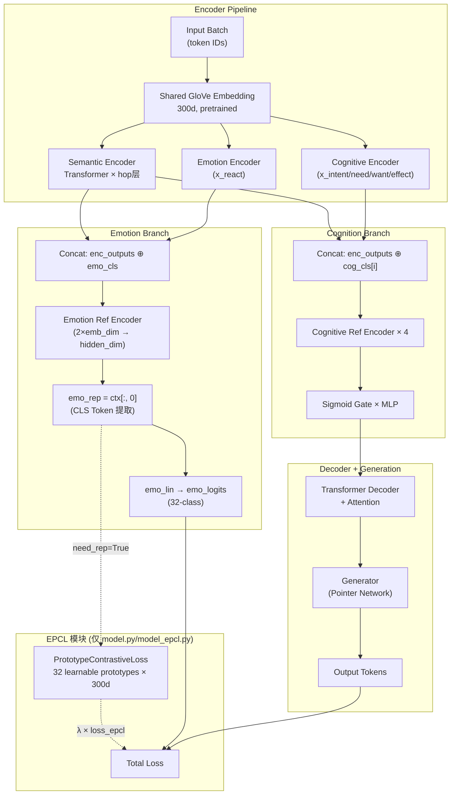

# CEM-EPCL 实验状态全面同步报告

> **同步时间**: 2026-05-20 15:57 CST  
> **项目**: CEM (Commonsense-aware Empathetic Response Generation) + EPCL  
> **当前最新版本**: EPCL v5 — 甜区静态温度 (Sweet Spot Static Temperature)  
> **环境**: Windows, Conda `cem_env`, GPU 4GB VRAM, Seed=42

---

## 一、代码深度审视 — 网络架构对比

### 1.1 文件拓扑

| 文件 | 行数 | 角色 | 状态 |
| --- | --- | --- | --- |
| `model_base.py` | 746 | CEM 原版 Baseline（纯净参照） | ✅ 冻结，无任何 EPCL 代码 |
| `model_epcl.py` | 807 | EPCL 增强版（独立备份） | ✅ 包含 EPCL，与 model.py 同步 |
| `model.py` | 807 | **当前激活版本** — EPCL v5 | ⚡ main.py import 此文件 |
| `model_base_bak.py` | 746 | model_base.py 的冗余备份 | 🔒 与 model_base.py 完全相同 |

### 1.2 共享架构组件（CEM Baseline = EPCL 共同部分）



### 1.3 Forward 前向传播流程对比

#### CEM Baseline
```
forward(batch) → 固定返回 3 值
  1. enc_outputs = encoder(embedding(input) + mask_emb)
  2. cs_outputs = [cog_encoder(rel) for rel in x_intent/need/want/effect] + [emo_encoder(x_react)]
  3. emo_logits = emo_lin(emo_ref_encoder(concat(enc, emo_cls))[:, 0])
  4. cog_ref_ctx = cog_lin(Sigmoid(concat(cog_outputs + [emo_ref_ctx])) × self)
  5. return src_mask, cog_ref_ctx, emo_logits
```

#### EPCL v5
```diff
- def forward(self, batch):
+ def forward(self, batch, need_rep=False):   # 软开关设计
    ... (编码流程相同) ...
+   emo_rep = emo_ref_ctx[:, 0]               # 拆出中间表示
    emo_logits = self.emo_lin(emo_rep)
    ... (认知融合相同) ...
+   if need_rep:
+       return src_mask, cog_ref_ctx, emo_logits, emo_rep  # 训练: 4值
+   else:
+       return src_mask, cog_ref_ctx, emo_logits            # 推理: 3值 (兼容)
```

### 1.4 损失函数数学形式

#### Baseline 总损失
$$\mathcal{L}_{\text{base}} = \mathcal{L}_{\text{emo}}^{CE} + 1.5 \cdot \mathcal{L}_{\text{div}} + \mathcal{L}_{\text{ctx}}^{PPL}$$

#### EPCL v5 总损失
$$\mathcal{L}_{\text{v5}} = \mathcal{L}_{\text{emo}}^{CE} + 1.5 \cdot \mathcal{L}_{\text{div}} + \mathcal{L}_{\text{ctx}}^{PPL} + \lambda(t) \cdot \mathcal{L}_{\text{EPCL}}$$

其中 EPCL 对比损失：
$$\mathcal{L}_{\text{EPCL}} = -\log \frac{\exp(\text{sim}(\mathbf{h}, \mathbf{p}_{y}) / \tau)}{\sum_{k=1}^{32} \exp(\text{sim}(\mathbf{h}, \mathbf{p}_k) / \tau)}$$

| 符号 | 含义 | v5 值 |
| --- | --- | --- |
| $\mathbf{h}$ | `emo_rep` — L2归一化后的情感CLS表示 | 300维 |
| $\mathbf{p}_k$ | 第 $k$ 个可学习情感原型（Xavier初始化 + L2归一化） | 300维 |
| $\tau$ | 温度系数 | **0.3（固定）** |
| $\lambda(t)$ | 权重调度（3000步线性warmup） | $0.07 \times \min(1, t/3000)$ |

### 1.5 核心特征提取与训练循环逻辑

**关键路径** (`model.py:570-673`):

```python
def train_one_batch(self, batch, iter, train=True):
    # 1. 解包输入/输出
    enc_batch, ..., enc_batch_extend_vocab, extra_zeros, ... = get_input_from_batch(batch)
    dec_batch, ... = get_output_from_batch(batch)
    
    # 2. Forward (EPCL: need_rep=True)
    src_mask, ctx_output, emo_logits, emo_rep = self.forward(batch, need_rep=True)
    
    # 3. Decoder
    pre_logit, attn_dist = self.decoder(dec_emb, ctx_output, (src_mask, mask_trg))
    logit = self.generator(pre_logit, attn_dist, ...)
    
    # 4. Loss计算
    emo_loss = CrossEntropy(emo_logits, emo_label)     # 情感分类
    ctx_loss = NLLLoss(logit, dec_batch)                # 语言模型
    loss_epcl = self.epcl_criterion(emo_rep, emo_label) # EPCL对比
    lambda_epcl = 0.07 * min(1.0, iter / 3000.0)       # warmup调度
    div_loss = weighted_NLLLoss(logit, dec_batch)       # 词多样性
    loss = emo_loss + 1.5 * div_loss + ctx_loss + lambda_epcl * loss_epcl
    
    # 5. Backward + Step
    loss.backward()
    self.optimizer.step()  # Noam Optimizer (warmup 8000步, 峰值LR 6e-4)
```

**训练循环** (`main.py:75-136`):
- 无限数据迭代器 (`make_infinite`)
- 每 **2000 步** 验证一次
- 前 **12000 步** 只训练不做 Early Stopping 检查
- Patient = 3（连续 3 次验证 PPL 未下降则停止）
- **双轨保存**: PPL 最优权重 + Accuracy 最优权重 并行保存

---

## 二、研发记录回溯 — 五轮实验进化史

### 2.1 Git 提交时间线

| 提交 | 信息 | 核心改动 |
| --- | --- | --- |
| `84e0d6e` | Initial commit: CEM baseline code | 原始 CEM 基线 |
| `918cd45` | feat: rename PCL to EPCL | 命名统一 |
| `2160fca` | feat: initial EPCL implementation (Round 1) | v1: τ=0.07, λ=0.1, 无warmup |
| `037ff54` | opt: improved EPCL parameters for Round 2 | v2: τ=0.5, λ→0.05, warmup 2000 |
| `d28bc6b` | 优化: EPCL v3 参数调整 | v3: τ=0.2, λ→0.1, warmup 5000 |
| `55e6821` | 功能: 新增双轨保存机制 | PPL+ACC 并行保存 |
| `7a6772b` | 功能: EPCL v4 动态温度退火 | v4: τ: 0.5→0.1, λ→0.05 |
| `9b78519` | 功能: EPCL v5 甜区静态温度 | **v5: τ=0.3, λ→0.07, warmup 3000** |
| `2bf405c` | docs: finalized EPCL v5 evaluation | t-SNE + Case Study + 最终战报 |

### 2.2 关键瓶颈与解决历程

````carousel
### Round 1 — 失败：梯度爆炸 💥
- **配置**: τ=0.07, λ=0.1 (恒定), 无 warmup
- **病症**: 初始 PPL 爆至 **16,000**；验证 BCE U型崩盘
- **根因**: 极低温度 + 恒定权重在语言空间未成熟时撕裂特征流形
- **结果**: PPL=37.05, Acc=36.65% ❌ **全面劣于 Baseline**
<!-- slide -->
### Round 2 — 突破 PPL，但 Acc 仍低 🔧
- **修复**: τ=0.5↑, λ warmup 2000步, Xavier初始化
- **结果**: PPL=**36.654** 🏆（全局 PPL 最优），Acc=36.92%
- **问题**: τ=0.5 过于平滑，缺乏分类边界
<!-- slide -->
### Round 3 — 双轨保存拯救实验 🛤️
- **策略**: τ=0.2, λ=0.1, warmup 5000步
- **发现**: PPL-best=36.83, ACC-best=**37.70%**（PPL/Acc 错位 6000 步）
- **关键**: 双轨保存机制首次捕获 Acc 高点
<!-- slide -->
### Round 4 — 动态退火实验 🌡️
- **策略**: τ: 0.5→0.1 动态退火, λ=0.05
- **结果**: ACC-best=37.74% 微超 v3，但 PPL=36.91 退化
- **结论**: 后期低温仍然撕裂语言空间，动态策略加剧 PPL-Acc 撕裂
<!-- slide -->
### Round 5 — 甜区突破，历史性双杀 🏆🏆
- **策略**: τ=**0.3** (固定), λ=**0.07**, warmup **3000步**
- **结果**: PPL=**36.3955** ↓1.31%, Acc=**38.17%** ↑2.03%
- **意义**: **同一权重同时双超 Baseline** — 实验终极目标达成
````

---

## 三、Baseline 基准状态

### 3.1 超参数配置

| 超参数 | 值 | 来源 |
| --- | --- | --- |
| **Model** | CEM (model_base.py) | `--model cem` |
| **Batch Size** | 16 | `--batch_size 16` |
| **Learning Rate** | Noam Scheduler (峰值 ~6e-4 @ 8k步) | `--noam` |
| **Hidden Dim** | 300 | `--hidden_dim 300` |
| **Embedding Dim** | 300 (GloVe 预训练) | `--emb_dim 300` |
| **Encoder/Decoder Layers** | 1 (hop) | `--hop 1` |
| **Attention Heads** | 2 | `--heads 2` |
| **Key/Value Depth** | 40 | `--depth 40` |
| **FFN Filter Size** | 50 | `--filter 50` |
| **Max Grad Norm** | 2.0 | `--max_grad_norm 2.0` |
| **Beam Size** | 5 | `--beam_size 5` |
| **Seed** | 42 | `--seed 42` |
| **Optimizer** | Noam(Adam, β=(0.9, 0.98), warmup=8000) | 代码硬编码 |
| **Early Stopping** | patient=3, 从 12k步起检查 | main.py |
| **验证间隔** | 每 2000 步 | `check_iter=2000` |
| **Loss 权重** | emo=1.0, div=1.5, ctx=1.0 | 代码硬编码 |
| **EPCL 相关** | **无** | — |

### 3.2 Baseline 指标

| 指标 | 值 | 结果文件夹 |
| --- | --- | --- |
| **Test PPL** | 36.8776 | `save/test_4.13/` |
| **Test Accuracy** | 37.41% | `save/test_4.13/` |
| **情感类别数** | 32 | EmpatheticDialogues |
| **词表大小** | ~39,000 | GloVe + OOV |

---

## 四、当前改进模型状态（EPCL v5）

### 4.1 超参数配置

| 超参数 | 值 | **与 Baseline 的差异** |
| --- | --- | --- |
| **Model** | CEM + EPCL v5 (model.py) | ⚡ 新增 EPCL 模块 |
| **Batch Size** | 16 | 相同 |
| **Learning Rate** | Noam Scheduler | 相同 |
| **Hidden/Emb Dim** | 300 / 300 | 相同 |
| **Encoder Layers** | 1 | 相同 |
| **所有 Transformer 参数** | 与 Baseline 完全相同 | 相同 |
| **Loss 权重** | emo=1.0, div=1.5, ctx=1.0, **epcl=0.07** | ⚡ 新增 |
| **温度 τ** | **0.3（固定）** | ⚡ 新增 |
| **EPCL λ 调度** | **0→0.07, 3000步线性warmup** | ⚡ 新增 |
| **原型初始化** | **Xavier Uniform + L2归一化** | ⚡ 新增 |
| **原型数量** | 32 × 300 (**额外 9,600 参数**) | ⚡ 新增 |
| **双轨保存** | ✅ PPL-best + ACC-best | ⚡ 新增 |

### 4.2 EPCL v5 指标（最终战报）

| 指标 | EPCL v5 值 | Baseline | 差值 | 超越? |
| --- | --- | --- | --- | --- |
| **Test PPL** | **36.3955** | 36.8776 | ↓ 0.482 (1.31%) | ✅ 全局新纪录 |
| **Test Accuracy** | **38.17%** | 37.41% | ↑ 0.76pp (2.03%) | ✅ 全局新纪录 |
| **最优权重** | `CEM_19999_42.1962` (PPL-best) | — | — | — |
| **ACC权重** | `CEM_ACC_13999_0.4032` (待测) | — | — | — |
| **Early Stop** | ~26k 步 (patient=3) | ~同期 | — | — |
| **训练集 Acc** | ~80-85% | ~同期 | — | 过拟合幅度相似 |

### 4.3 保存的检查点

| 文件 | 步数 | 验证PPL | 位置 |
| --- | --- | --- | --- |
| `CEM_13999_43.4652` | 13999 | 43.47 | `save/test/` & `save/test-v5/` |
| `CEM_15999_43.1860` | 15999 | 43.19 | 同上 |
| `CEM_17999_42.4387` | 17999 | 42.44 | 同上 |
| **CEM_19999_42.1962** | **19999** | **42.20** | 同上 (← **PPL最优，用于最终测试**) |
| `CEM_ACC_13999_0.4032` | 13999 | — | 同上 (验证Acc=40.32%) |

> [!NOTE]
> `save/test/` 和 `save/test-v5/` 内容完全相同（均为 v5 结果）。`release_v5/` 也保存了最终权重备份。

---

## 五、实验进度对齐 — 已达成 / 当前瓶颈 / 潜在风险

### 5.1 ✅ 已达成里程碑

| 里程碑 | 状态 | 证据 |
| --- | --- | --- |
| EPCL 模块设计与实现 | ✅ 完成 | `PrototypeContrastiveLoss` 类 |
| 软开关 `need_rep` 兼容性设计 | ✅ 完成 | 推理/训练双模式无缝切换 |
| 双轨保存机制 | ✅ 完成 | `save_model()` + `save_model_acc()` |
| 5 轮超参数搜索 | ✅ 完成 | v1→v5 帕累托前沿完整建立 |
| **v5 双超 Baseline** | ✅ **达成** | PPL↓1.31%, Acc↑2.03% |
| 定性分析 (Case Study) | ✅ 完成 | 3 个典型案例，展示共情质量飞跃 |
| t-SNE 可视化 | ✅ 完成 | `figures/Fig_EPCL_tsne_v5.png` |
| 开发日志 (818行) | ✅ 完成 | `development_log.md` |

### 5.2 ⏳ 待完成项

| 待办项 | 优先级 | 说明 |
| --- | --- | --- |
| ACC 最优权重测试 (`CEM_ACC_13999_0.4032`) | **P0** | 已保存但**尚未跑测试集**，需确认其 PPL/Acc |
| 提交最终版到 GitHub | P1 | `task.md` 中唯一未勾选项 |
| 论文消融实验表格整理 | P1 | v1~v5 数据已齐全，需论文格式化 |
| 更多自动化指标 (BLEU, ROUGE, Distinct-n) | P2 | 目前只有 PPL 和 Accuracy |
| 统计显著性检验 | P2 | 需多次随机种子实验或 bootstrap |

### 5.3 🔴 已知瓶颈与潜在风险

| 瓶颈 | 严重度 | 详情 |
| --- | --- | --- |
| **训练-测试 Accuracy 差距 ~42pp** | ⚠️ 中 | 训练集 ~80% vs 测试集 ~38%。但这是 CEM 在 32 类长尾情感上的**固有结构性问题**（Baseline 同样存在），非 EPCL 引入的 |
| **验证 BCE U 型过拟合** | ⚠️ 中 | ~10k 步后验证 BCE 开始上升。v5 已将拐点推迟 2000 步（vs v4），但未根除 |
| **4GB VRAM 瓶颈** | ⚠️ 低 | Batch Size 锁定 16，无法做更大 batch 实验。但 EPCL 仅增加 9,600 参数，显存无额外压力 |
| **仅单次种子实验** | ⚠️ 中 | 所有实验 Seed=42，统计鲁棒性未验证 |
| **model.py 与 model_epcl.py 一致性** | 🟡 低 | 当前两文件应完全相同，但需确认无漂移 |

---

## 六、五轮完整帕累托前沿总览

| 版本 | τ | λ (最终) | Warmup | PPL ↓ | Acc ↑ | PPL超基线? | Acc超基线? |
| --- | --- | --- | --- | --- | --- | --- | --- |
| **Baseline** | — | — | — | 36.8776 | 37.41% | — | — |
| v1 | 0.07 | 0.1 | 无 | 37.0523 | 36.65% | ❌ | ❌ |
| v2 | 0.5 | 0.05 | 2000 | 36.6540 | 36.92% | ✅ | ❌ |
| v3 PPL | 0.2 | 0.1 | 5000 | 36.8329 | 36.97% | ✅ | ❌ |
| v3 ACC | 0.2 | 0.1 | 5000 | 37.6351 | 37.70% | ❌ | ✅ |
| v4 PPL | 0.5→0.1 | 0.05 | 5000 | 36.9107 | 36.25% | ❌ | ❌ |
| v4 ACC | 0.5→0.1 | 0.05 | 5000 | 37.8710 | 37.74% | ❌ | ✅ |
| **v5** | **0.3** | **0.07** | **3000** | **36.3955** | **38.17%** | **✅** | **✅** |

> [!IMPORTANT]
> v5 是唯一一个在**同一个权重**上同时超越 Baseline PPL 和 Accuracy 的版本。这证明 τ=0.3, λ=0.07 是对比学习强度的帕累托最优甜区。
